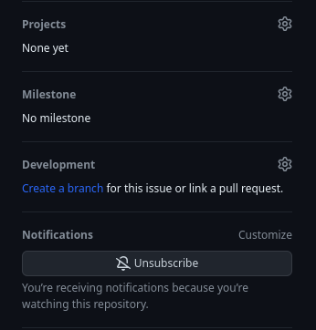
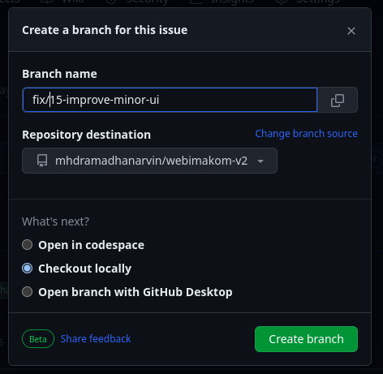
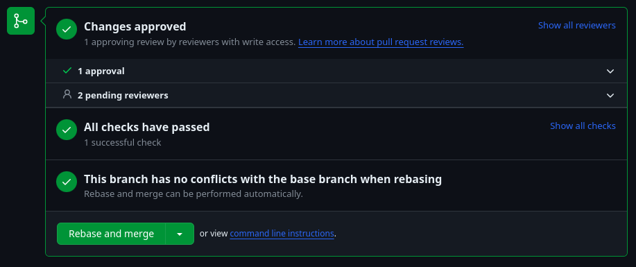

# Imakom v2.0.0

## About

Ini repositori project website Ikatan Mahasiswa Komputer - Universitas Pembangunan Pancabudi, dibuat sebagai media organisasi untuk kebutuhan internal dan promosi aktivitas kegiatan yang dilaksanakan organisasi. Projek ini dapat digunakan secara berkelanjutan untuk generasi mendatang.

## Feature

Beberapa fitur di project ini :

- Struktur Organisasi (**DONE**).
- Divisi Organisasi (**DONE**).
- Program Kerja (**DONE**). 
- Artikel (**DONE**). 
- Dokumentasi (**DONE**). 

## Technology

- PHP 8.2
  Bahasa pemrograman yang digunakan
- [Laravel v10](https://laravel.com/docs/10.x)
  Base framework yang digunakan untuk membangun projek ini.
- [TailwindCSS v3](https://tailwindcss.com/)
  Framework css yang digunakan untuk mendesain projek ini.
- [FilamentPHP](https://filamentphp.com/)
  Library php yang dipakai untuk membangun CMS atau admin panel yang dapat mengontrol content di project ini.

## How to Run

Step yang perlu dilakukan untuk dapat menjalankan projek ini.

### Docker Installation (Recommend)

Step ini disarankan untuk dilakukan dengan pengetahuan tentang Docker. Kebutuhan sebelum instalasi.

- [Docker include Docker Compose ](https://docs.docker.com/get-docker/) 

Jalankan perintah ini di terminal

```bash
# copy env file
cp .env.example .env
# install dependency php 
compose install
# jalankan container
./vendor/bin/sail up -d
# install dependency js 
./vendor/bin/sail npm install
# jalankan migrasi dan seeder
./vendor/bin/sail artisan migrate:refresh --seed
# generate ulang shield
./vendor/bin/sail artisan shield:generate --all
# buat akun admin
./vendor/bin/sail artisan shield:super-admin --user=1
# build ui
./vendor/bin/sail npm run build
```

Saat proses development selalu jalankan perintah ini, dan biarkan tetap berjalan

```bash
./vendor/bin/sail npm run dev
```

### Manual Installation

Jalankan perintah ini di terminal

```bash
# copy env file
cp .env.example .env
composer install 
# install dependency js 
npm install
# jalankan migrasi dan seeder
php artisan migrate:refresh --seed
# generate ulang shield
php artisan shield:generate --all
# buat akun admin
php artisan shield:super-admin --user=1
# build ui
npm run build
```

Saat proses development selalu jalankan perintah ini, dan biarkan tetap berjalan

```bash
./vendor/bin/sail npm run dev
```

dan pada terminal lain jalankan 

```bash
php artisan serve
```
## Access

Home page dapat diakses pada :
- Docker Installation : [http://localhost](http://localhost) atau 
- Manual Installation : [http://localhost:8000](http://localhost:8000)

Admin panel dapat diakses pada : 
- Docker Installation : [http://localhost/admin](http://localhost/admin) atau 
- Manual Installation : [http://localhost:8000/admin](http://localhost:8000/admin)

Gunakan akun ini untuk akses admin panel :
- email: `admin@gmail.com` 
  password `admin`

## Kontribusi

Projek ini menggunakan [Trunk Base Development](https://trunkbaseddevelopment.com/) sebagai branching strategy. Pada Trunk Base Development kita hanya memiliki satu long-lived development branch yaitu **main** branch. Apabila ingin berkontribusi untuk menambahkan fitur atau memperbaiki bug maka perlu membuat branch baru dari *main* branch lalu lakukan PR ke **main** branch. 

Selain menggunakan Trunk Base Development projek ini juga menggunakan [Conventional Commit](https://www.conventionalcommits.org/) untuk setiap nama branch dan commit untuk mempermudah tracking dan pemahaman setiap commit.

### Penamaan Branch 

- **main**: Main branch. Kita menggunakan Trunk-Based Development
- **feat/<ticket-number>-<short-detail>**: Feature branch. Ex: feat/122-new-implementation-algorithm
- **fix/<ticket-number>-<short-detail>**: Bugfix branch. Ex: fix/122-error-ini
- **refactor/<ticket-number>-<short-detail>**: Branch untuk cleanup kode atau refactor. Ex: refactor/122-missing-comments
- **test/<ticket-number>-<short-detail>**: Branch untuk penambahan testing. Ex: test/122-missing-test-when-update-user

### Jenis Commit

Referensi : [Conventional Commit](https://www.conventionalcommits.org/en/v1.0.0/#summary)
- **feat**: Fitur baru 
- **fix**: Perbaikan bugs 
- **refactor**: Perbaikan kode atau refactor 
- **test**: Penambahan test 
- **chore**: Penambahan dependency 

### Pull Request / Merge Request (PR/MR)

Setiap title PR harus sesuai dengan format dibawah ini 

**<type>[optional scope]: <description>**

- **feat(web): adding authentication**
- **fix(backoffice): fix the order list**

### Langkah Langkah Kontribusi 

1. Pilih atau buat [issue](https://github.com/mhdramadhanarvin/webimakom-v2/issues) baru yang ingin dikerjakan.  
2. Buat branch baru dari issue tersebut.


3. Jalankan perintah ini di local.

    ```bash
    # fetch semua perubahan dari origin termasuk branch baru
    git fetch origin
    # checkout ke branch baru
    git checkout fix/15-improve-minor-ui
    ```

4. Sekarang sudah bisa mulai mengerjakan.
5. Apabila selesai mengerjakan, buat PR dengan title yang sesuai dengan issue tersebut, dan assign reviewer.
6. Forward ke channel untuk mempercepat proses review PR sekaligus menyertakan before dan after (optional).
7. Apabila salah satu reviewer sudah **Approve** PR yang dibuat maka selanjutnya PR bisa di merge dengan pilih **Rebase and Merge** 
